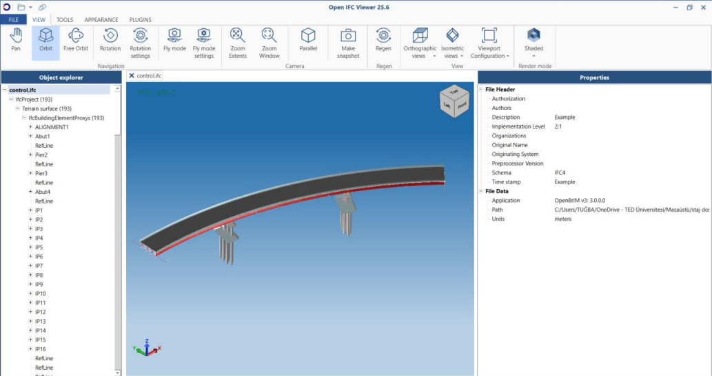
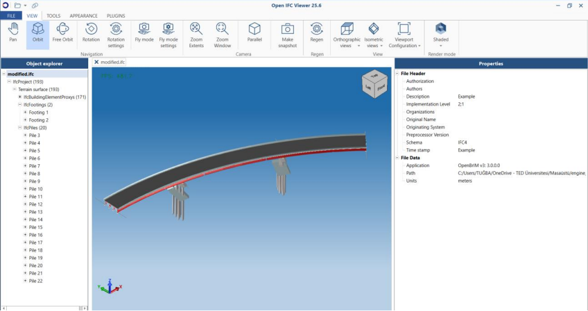

# IFC Entity Converter

## 📘 Overview

In many early-stage BIM models, placeholder entities like `IFCBUILDINGELEMENTPROXY` are used to represent structural components such as piles and footings. However, as the model progresses toward more detailed and standards-compliant stages, semantic clarity becomes essential.

This project automates the transformation of those generic components into meaningful IFC types. By analyzing the `Name` property of each entity (e.g., names beginning with `"Pile"` or `"Footing"`), the model replaces them with appropriate classes (`IFCPILE`, `IFCFOOTING`), ensuring:

- Spatial structure and aggregation relationships are preserved
- Metadata and ownership history remain intact
- The resulting IFC model becomes more interoperable and readable

This is particularly beneficial in infrastructure projects governed by standards like **AASHTO**, **buildingSMART IFC** and **BIM Applications**.

Developed using the engine_web-ifc(https://github.com/ThatOpen/engine_web-ifc) for efficient manipulation of IFC models directly in Node.js.

## ✨ Features

- 🔄 **Automatic semantic upgrade**: Converts generic IFC proxies into semantically accurate structural components. (`Pile` ➜ `IFCPILE`, `Footing` ➜ `IFCFOOTING` etc.)
- 🧠 **Preserves spatial and structural relations**: Ensures that `IFCRELAGGREGATES` and `IFCRELCONTAINEDINSPATIALSTRUCTURE` references are updated accordingly.
- 🧩 **Metadata consistency**: Maintains `OwnerHistory`, `ObjectPlacement`, `Representation`, and `Tag`.
- 💾 **Exports enriched IFC file**: Final output is saved as `modified.ifc` for immediate use in downstream BIM tools.
- 📏 **Infrastructure-ready modeling**: Helps prepare data for bridge.

## 🧰 Tech Stack

| Technology    | Description                                      |
|---------------|--------------------------------------------------|
| **Node.js**   | JavaScript runtime for backend processing        |
| **web-ifc**   | Lightweight IFC engine for reading/writing IFC   |
| **IFC4 Schema** | OpenBIM data standard by buildingSMART         |

          
---
## 🖼️ Screenshots

| Before refactoring | After refactoring|
|-------------------|-----------------------|
|  |  |

---

## 📚 References

IFC Schema: https://standards.buildingsmart.org/IFC/DEV/IFC4_2/FINAL/HTML/link/alphabeticalorder-entities.htm

IFCJS Library (engine_web-ifc): https://github.com/ThatOpen/engine_web-ifc

buildingSMART International: https://www.buildingsmart.org

---
